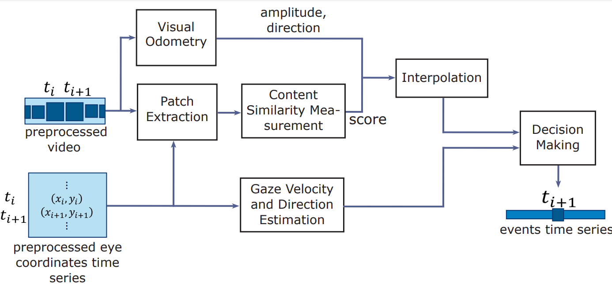

# ACE-DNV: Automatic Classification of Gaze Events in Dynamic Natural Viewing

## Introduction
we introduce a natural viewing eye-movement event classification method that takes head and body motion into account only relying on the scene camera and gaze signal which are provided by a mobile eye-trackers.



Automatic Classification of Gaze Events in Dynamic Natural Viewing (ACE-DNV) method computes the motion in gaze and head in conjunction with similarity of content in the central visual field and feeds them as input to a classification algorithm to detect gaze fixation, gaze following, gaze pursuit, and gaze shift.


## Execution
The code is tested on UBUNTU 18.06. 
For running the code you need:

1. PyTorch
2. OpenCV
3. Python Libraries: numpy, matplotlib, scipy 
4. 2ch2stream Network (included in repo)
5. (OPTIONAL) MATLAB for some data inspection scripts

Executation of DF-VO for now should be done seporately. The output of DF-VO should be stored in the recording folder along. Please note that you will need the camera matrix for the visual odometry.
To execute the code, edit the `config.py` file and select your dataset and input directory and the rest of params. The exectute 'main.py'.

## Citing Us
In case of using this code in your research or project please cite the paper below:

```
Citation will be provided
```


## Remark and Acknowledgement
This code has been developed at the department of Research and Improvement of Care, Royal Dutch Visio by Ashkan Nejad.

This project has received funding from the European Union’s Horizon 2020 research and innovation programme under the Marie Sklodowska-Curie grant agreement No 955590.

We would like to thank the researchers who helped us by providing the impelementation of their work publicly. Parts of this code is extracted from these repositories. Those files start with a commented link to the original repo:
1. https://github.com/elmadjian/OEMC
2. https://github.com/Huangying-Zhan/DF-VO
3. https://github.com/szagoruyko/cvpr15deepcompare


    

